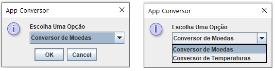
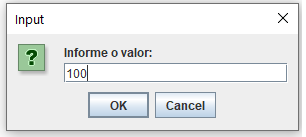
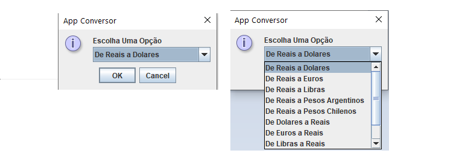
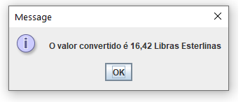

<h1>Conversor de Moedas e Temperaturas em Java</h1>

 <h2>Tecnologias Utilizadas</h2>
 <ul>
  <li>Jdk 19</li>
  <li>Java Swing</li>
  <li>Git</li>  
 </ul>

 <h2>Execução</h2>
 
Basta ter a JVM, a partir da versão 8, instalada em seu sistema operacional, fazer o dowload do arquivo "Conversor.jar" e executá-lo

 <h2>Finalidade</h2>
 
 Este aplicativo tem a finalidade de fazer converções de moedas ou de temperatudas

 <h2>Principais telas da Aplicação</h2>
 <h3>Tela inicial da aplicação.</h3>
 
 
Nesta tela o usuário escolhe qual o tipo de conversão deseja fazer.

 <h3>Tela de Input</h3>
 
 
Nesta tela é informado o valor a ser convertido.

 <h3>Tela de Origem/Destino</h3>
 
 
Nesta tela o usuário escolhe de qual moeda para qual moeda deseja fazer a conversão.

 <h3>Resultado</h3>
 
 
Aqui é informado o resultado da conversão

 <h2>Conclusão</h2>

Este aplicativo foi desenvolvido como parte do curso de formação Oracle One Next Education, nele, foram utilizados vários conceitos da linguagem Java e da Programação Orientada a Objetos.

